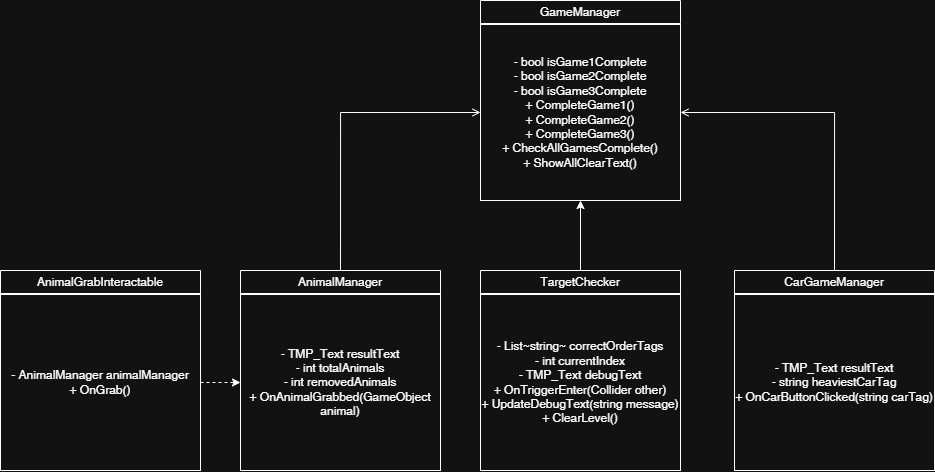

# 가상현실 기말 프로젝트

## Unity VR Toolkit – Interaction Learning Game

이 프로젝트는 **Unity XR Interaction Toolkit**을 활용한 **기초 VR 상호작용 학습용 게임**입니다.  
플레이어는 다양한 VR 상호작용(잡기, 놓기, 충돌, 클릭 등)을 체험하며  
세 가지 미니게임을 통해 VR 환경에서의 물리 및 이벤트 흐름을 학습할 수 있습니다.

## 프로젝트 개요

| 미니게임 | 설명 | 주요 스크립트 |
|-----------|------|----------------|
| **Game 1: Disk Order Game** | 디스크를 올바른 순서로 고리에 던져 넣기 | `TargetChecker.cs` |
| **Game 2: Car Weight Game** | 자동차 중 가장 무거운 차량을 선택하기 | `CarGameManager.cs` |
| **Game 3: Animal Catch Game** | 동물 오브젝트를 잡아서 제거하기 | `AnimalGrabInteractable.cs`, `AnimalManager.cs` |
| **전체 관리** | 세 게임 모두 완료 시 “All Clear!” 표시 | `GameManager.cs` |

---

## ⚙️ 작동 원리

### 🎯 Game 1: 순서 맞히기
- `TargetChecker`가 각 **디스크 태그(Disk1~Disk5)** 를 순서대로 감지합니다.  
- 올바른 순서로 들어오면 `"Clear!!!"` 메시지 출력 후 `GameManager.CompleteGame1()` 실행.

### 🚗 Game 2: 무게 비교
- 버튼 클릭 시 `CarGameManager.OnCarButtonClicked()` 호출.  
- 올바른 자동차(`Car6`)를 선택하면 `"Clear!"` 출력 후 `CompleteGame2()` 호출.

### 🐾 Game 3: 동물 잡기
- 각 동물에 붙은 `AnimalGrabInteractable`이 **Grab 이벤트** 감지.  
- 잡으면 `AnimalManager.OnAnimalGrabbed()`이 호출되어 오브젝트 `Destroy()`.  
- 모든 동물이 사라지면 `"Clear!"` 출력 후 `CompleteGame3()` 실행.

### 🧠 GameManager (중앙 제어)
- 각 게임 완료 시 `CompleteGame1/2/3()` 호출.  
- 세 가지 모두 완료되면 `"All Clear!"` UI가 활성화됩니다.

---

## 🧭 클래스 다이어그램

> 각 게임 스크립트는 `GameManager`를 중심으로 동작하며,  
> Grab / Trigger / Click 이벤트를 통해 개별 미션이 완료되면  
> 중앙 관리 시스템으로 신호가 전달됩니다.
